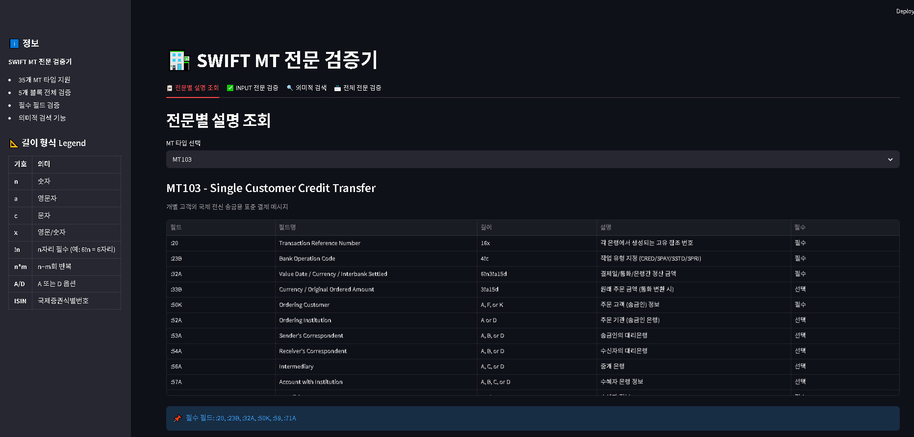
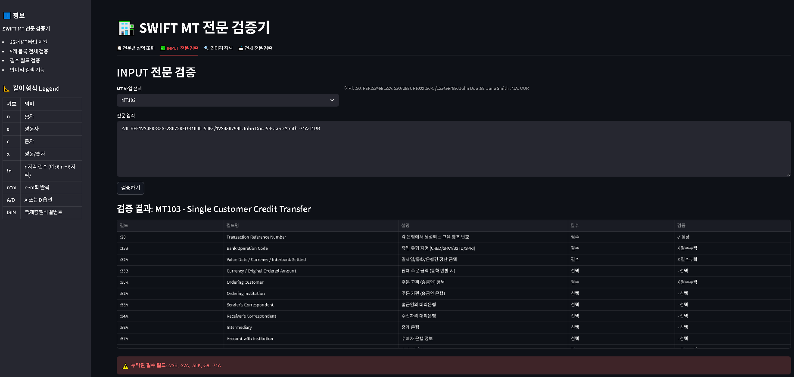
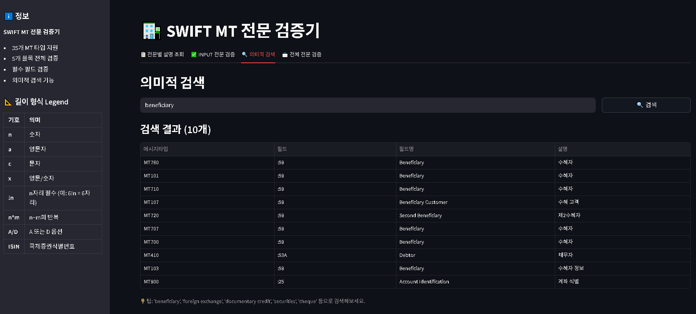
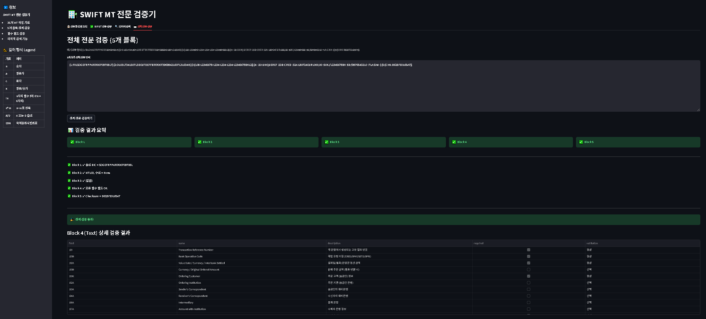

# SWIFT MT Validator

SWIFT MT 메시지 검증기 - 5개 블록 구조 검증, 필수 필드 체크, 의미적 검색

## 주요 기능

- 35개 MT 타입 지원 (MT103, MT202, MT700 등)
- 5개 블록 전체 검증 (Block 1~5)
- 필수 필드 자동 검증
- 의미적 검색 (Vector DB)

## 화면 구성

### Tab 1: 전문별 설명 조회


- 35개 이상 MT 타입 지원
- 각 MT 타입의 필드 정보 조회 (필드 번호, 이름, 길이, 설명, 필수 여부)
- 필수 필드 하이라이트

### Tab 2: INPUT 전문 검증


- 선택한 MT 타입에 대한 Block 4 (Text) 검증
- 사용자 입력 메시지에서 필드 파싱
- 필수 필드 누락 여부 검사

### Tab 3: 의미적 검색


- ChromaDB 기반 임베딩 검색
- 자연어로 필드 설명 검색 가능
- 예: "beneficiary", "foreign exchange" 등

### Tab 4: 전체 전문 검증


- 5개 블록 전체 검증
  - **Block 1 (Basic Header)**: 송신 BIC, 서비스 ID 검증
  - **Block 2 (Application Header)**: 메시지 타입, 방향, 수신 BIC 검증
  - **Block 3 (User Header)**: UETR, 서비스 코드 검증
  - **Block 4 (Text)**: 필수 필드 검증
  - **Block 5 (Trailer)**: 체크섬(CHK) 검증

## 프로젝트 구조

```
swift/
├── streamlit_app.py           # Streamlit 메인 앱 (4개 탭)
├── swift_parser.py            # 5개 블록 파서 및 검증
├── mt_required_data.py        # 35개 MT 타입 필드 정보
├── requirements.txt            # Python 의존성
├── README.md                   # 이 파일
├── .gitignore                 # Git 무시 파일
├── images/                    # 스크린샷
│   ├── tab1-description.png   # 전문별 설명 조회
│   ├── tab2-validation.png    # INPUT 전문 검증
│   ├── tab3-search.png        # 의미적 검색
│   └── tab4-full-validation.png # 전체 전문 검증
└── data/
    ├── chroma_db/             # Vector DB (Chroma)
    └── mt_documents.json      # MT 필드 데이터
```

## 사용 방법

### 1. 클론
```bash
git clone https://github.com/topslee-dev/swift.git
cd swift
```

### 2. 가상환경 생성
```bash
python -m venv .venv
# Windows
.venv\Scripts\activate
# Linux/Mac
source .venv/bin/activate
```

### 3. 의존성 설치
```bash
pip install -r requirements.txt
```

### 4. 실행
```bash
# Windows
.venv\Scripts\streamlit.exe run streamlit_app.py
# Linux/Mac
streamlit run streamlit_app.py
```

브라우저에서 `http://localhost:8501`로 접속

## 지원 MT 타입

| 카테고리 | MT 타입 | 설명 |
|---------|---------|------|
| Category 1 | MT101, MT102, MT102Plus, MT103, MT107 | 고객 신용 전송 |
| Category 2 | MT202, MT202COV, MT205, MT205COV | 금융기관 전송 |
| Category 3 | MT300, MT303, MT320, MT330, MT340 | 외환/대출/예금 |
| Category 4 | MT400, MT410 | 수표/압류 |
| Category 5 | MT506, MT509, MT515 |증권 정산 |
| Category 6 | MT600 | 무역 서비스 |
| Category 7 | MT700, MT707, MT710, MT720, MT760 | 신용장/보증 |
| Category 9 | MT900, MT910, MT940 | 확인/명세서 |

## 아키텍처

### 1. Streamlit UI (streamlit_app.py)
- 4개 탭 구성:
  - 전문별 설명 조회
  - INPUT 전문 검증
  - 의미적 검색
  - 전체 전문 검증

### 2. SWIFT 파서 (swift_parser.py)
- 5개 블록 파싱
- 각 블록 검증:
  - Block 1: Basic Header (F01 + BIC)
  - Block 2: Application Header (메시지 타입)
  - Block 3: User Header (UETR)
  - Block 4: Text (필드 검증)
  - Block 5: Trailer (체크섬)

### 3. 데이터 (mt_required_data.py)
- 35개 MT 타입 정의
- 각 필드: 번호, 이름, 길이, 설명, 필수여부

### 4. Vector DB (Chroma)
- 의미적 검색 기능
- OpenAI text-embedding-3-small 사용 (1536차원)

## 기술 스택

| 기술 | 용도 |
|------|------|
| Python | 프로그래밍 언어 |
| Streamlit | 웹 프레임워크 |
| Chroma DB | Vector Database |
| OpenAI | 텍스트 임베딩 |
| Pandas | 데이터 처리 |

## 참고 사항

이 프로그램은 교육 및 검증 목적으로 만들어졌습니다. 실제 금융 거래에는 공식 SWIFT 검증 도구를 사용하세요.